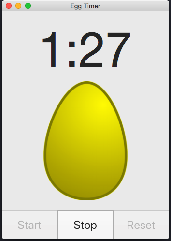

# EggTimer

Simple timer application written using Swift.

The following project utilizes the Cocoa framework to create a timer for cooking hard-boiled eggs. Users can set the timer anywhere between 1-25 minutes. Once the timer has passed quarter percentages of the overall timer length, the displayed egg image will change to show the corresponding egg "doneness". Credit to Ray Wenderlich's tutorial.

#Work in progress(WIP)

